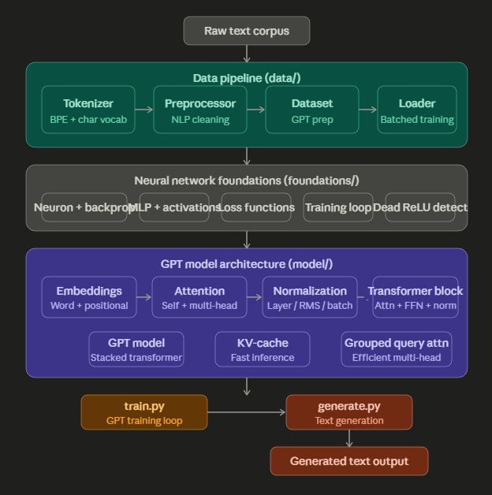

# Tuner Design GPT — Built from Scratch

A complete GPT implementation built component by component from first principles in Python.
Every module in this repository — from gradient descent to multi-headed attention to text
generation — was written and tested independently before being composed into a working model.

## Architecture



## Project structure

```
model/          Attention, Transformer, GPT architecture
  attention.py             Self-attention head
  multi_head_attention.py  Multi-headed attention
  transformer.py           Transformer block
  gpt.py                   GPT model
  normalization.py         Layer normalization
  batch_normalization.py   Batch normalization
  rms_normalization.py     RMS normalization
  embeddings.py            Word embeddings
  positional_encoding.py   Positional encoding
  kv_cache.py              KV-Cache for fast inference
  grouped_query_attention.py  Grouped query attention

data/           Data pipeline
  tokenizer.py                BPE tokenizer
  vocab.py                    Character-level vocabulary
  loader.py                   Batched training data loader
  dataset.py                  GPT dataset preparation
  nlp_preprocessing.py        NLP preprocessing
  tokenizer_utils.py          Tokenization edge cases

train.py        GPT training loop
generate.py     Text generation

foundations/    Neural network primitives built from scratch
  neuron.py, backprop.py, mlp.py, activations.py, loss.py,
  training_loop.py, dead_relu_detector.py, ...
```

## What was built from scratch

**Foundations** — gradient descent, backpropagation, MLP, activation functions,
loss functions, and a full training loop, all implemented without PyTorch autograd
to build mechanical understanding before using the framework.

**Data pipeline** — a BPE tokenizer, character-level vocabulary builder, NLP
preprocessing utilities, a GPT-style dataset class, and a batched data loader
handling sequence alignment and padding.

**Model architecture** — self-attention, multi-headed attention, grouped query
attention, three normalization variants (layer, RMS, batch), positional encoding,
word embeddings, a full transformer block, and the GPT model stacking N blocks
with a language model head.

**Inference optimization** — KV-cache implementation for fast autoregressive
generation, avoiding redundant key/value recomputation at each decoding step.

## Quick start

```bash
pip install -r requirements.txt
python train.py
python generate.py
```

## Stack

Python · PyTorch · NumPy
